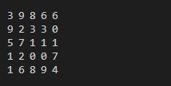

Задача: Найти элемент в двумерном массиве (заполненном случайными числами от 0 до 9) по параметрам индекса этого элемента, введеным с клавиатуры.
========================

### **Для решения данной задачи необходимо выполнить следующий алгоритм:**

*1. Запросить параметры для массива.*
> Пользователь будет вводить количество строк и столбцов с клавиатуры.
> Если введеные данные не числовые, то программа должна сообщить об этом.

*2. Описать метод по созданию и заполнению массива в соответствии с тем размером, который ввел пользователь.*
> Массив должен быть заполнен числами в соответствии с условиями задачи.

*3. Описать метод по выводу массива на экран.*
> Например:

*4. Запросить параметры для искомого элемента.*
> Пользователь будет вводить индекс по строке и столбцу с клавиатуры.
> Если введеные данные не числовые, то программа должна сообщить об этом.

*5. Описать метод по поиску и выводу искомого элемента.*
> Если элемента нет (индексы введенные с клавиатуры не входят в размер массива), то программа должна сообщить об этом.